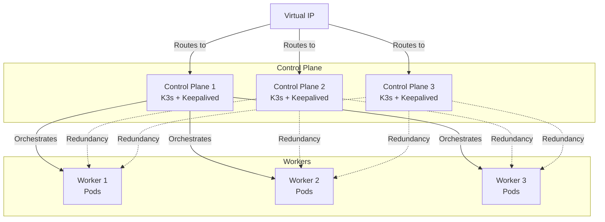

import TabsOS from '../../../components/TabsOS.astro';
import TabItemWindows from '../../../components/TabItemWindows.astro';
import TabItemLinux from '../../../components/TabItemLinux.astro';
import { Steps } from '@astrojs/starlight/components';

## Prerequisites

- A load balancer IP or hostname.
- Access to all control plane and worker nodes.

## Architecture



## Installation

<TabsOS>
    <TabItemLinux>
        <Steps>

        1. **Install NFS support (optional)**

            If your cluster will use NFS for persistent storage, install the `nfs-common` package on all nodes (both control plane and worker nodes) by running the following command:

            ```bash
            sudo apt install nfs-common
            ```


        1. **Setup Keepalived for Virtual IP (optional)**

            To access the cluster via a single Virtual IP (VIP), you can install `keepalived` on the control plane nodes. This allows you to use a single IP address to access the Kubernetes API server, even if one of the control plane nodes goes down.

            Install `keepalived`:

            ```bash
            sudo apt install keepalived
            ```

            Create the configuration file:

            ```bash
            sudo nano /etc/keepalived/keepalived.conf
            ```

            **Master Node Configuration:**

            Replace `<interface>` with your network interface (e.g., `eth0`, `ens18`), `<password>` with a secure password, and `<virtual-ip>` with your desired VIP.

            ```conf
            vrrp_instance VI_1 {
                state MASTER
                interface <interface>
                virtual_router_id 56
                priority 255
                advert_int 1
                authentication {
                    auth_type PASS
                    auth_pass <password>
                }
                virtual_ipaddress {
                    <virtual-ip>/24
                }
            }
            ```

            **Backup Node Configuration:**

            For additional control plane nodes, use the `BACKUP` state and a lower priority (e.g., 254, 253).

            ```conf
            vrrp_instance VI_1 {
                state BACKUP
                interface <interface>
                virtual_router_id 56
                priority 254
                advert_int 1
                authentication {
                    auth_type PASS
                    auth_pass <password>
                }
                virtual_ipaddress {
                    <virtual-ip>/24
                }
            }
            ```

            Enable and start the service:

            ```bash
            sudo systemctl enable --now keepalived.service
            sudo systemctl status keepalived.service
            ```

        1. **Install k3s on the first control plane node**

            Run the following command to install k3s. Replace `<load-balancer-ip-or-hostname>` with your Load Balancer IP or the Virtual IP (VIP) if you set up Keepalived.

            ```bash
            curl -sfL https://get.k3s.io | sh -s - server \
                --cluster-init \
                --node-taint CriticalAddonsOnly=true:NoExecute \
                --tls-san <load-balancer-ip-or-hostname>
            ```

        1. **Retrieve the cluster token**

            After the installation, retrieve the `<cluster-token>` and take note of it:

            ```bash
            cat /var/lib/rancher/k3s/server/node-token
            ```

        1. **Install k3s on additional control plane nodes**

            Run the following command to install k3s and link it to the cluster. Replace `<control-plane-01-ip>` with the IP of the first control plane node or the VIP.

            ```bash
            curl -sfL https://get.k3s.io | sh -s - server \
                --node-taint CriticalAddonsOnly=true:NoExecute \
                --tls-san <load-balancer-ip-or-hostname> \
                --server https://<control-plane-01-ip>:6443 \
                --token <cluster-token>
            ```

        1. **Install k3s on all the worker nodes**

            Run the following command to install k3s and link it to the cluster. Replace `<control-plane-01-ip>` with the IP of the first control plane node or the VIP.

            ```bash
            curl -sfL https://get.k3s.io | sh -s - agent \
                --server https://<control-plane-01-ip>:6443 \
                --token <cluster-token>
            ```

        </Steps>
    </TabItemLinux>
</TabsOS>

## Configure local `kubectl` access

<TabsOS>
    <TabItemWindows>
        <Steps>

        1. Retrieve the Kubernetes configuration from one of the control plane nodes:

            ```bash
            sudo cat /etc/rancher/k3s/k3s.yaml
            ```

        1. Save the content to a file located at `%USERPROFILE%/.kube/<filename-without-extension>` on your local machine.
        Rename the `default` context to your preferred cluster name.

        1. Add configuration to `kubectl`. In PowerShell, run:

            ```powershell
            Get-ChildItem -Path "$($env:USERPROFILE)/.kube" -File | ForEach-Object {
                $configFiles += $_.FullName + ";"
            }

            [Environment]::SetEnvironmentVariable("KUBECONFIG", $configFiles, "USER")
            ```

        1. Switch to the new context:

            ```bash
            kubectl config use-context <context-name>
            ```
            
        </Steps>
    </TabItemWindows>
</TabsOS>